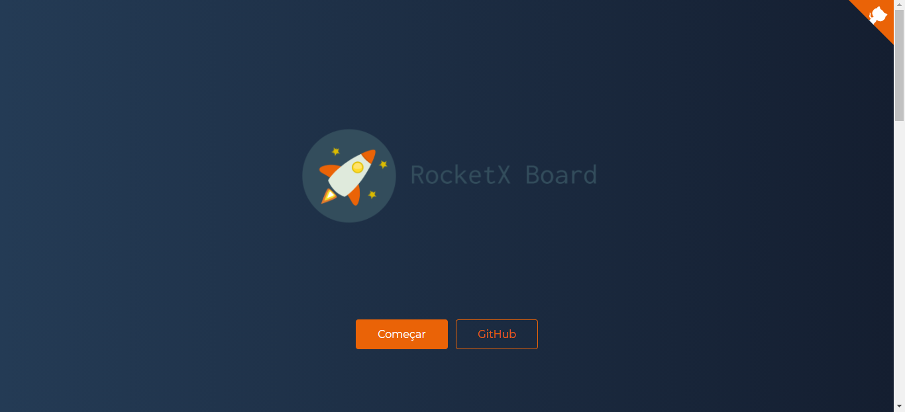
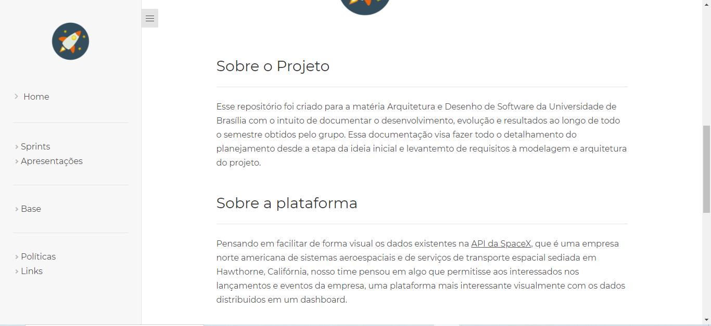
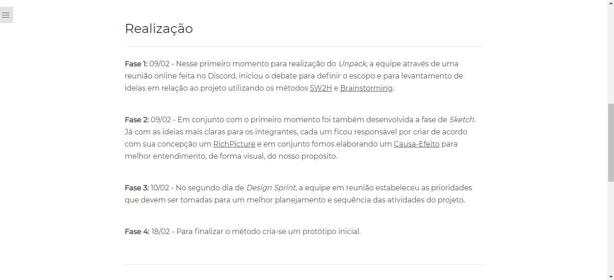
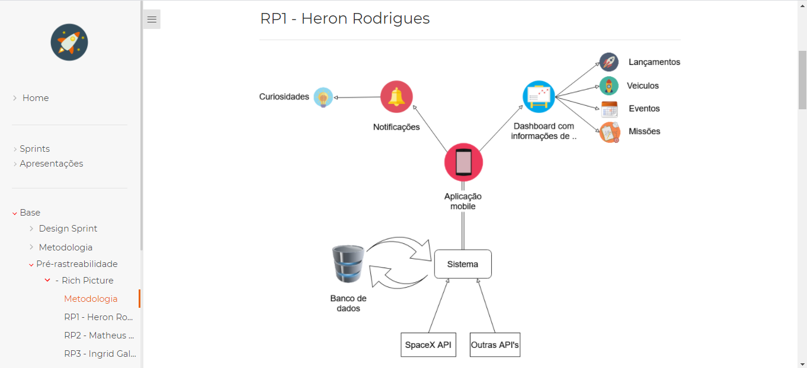
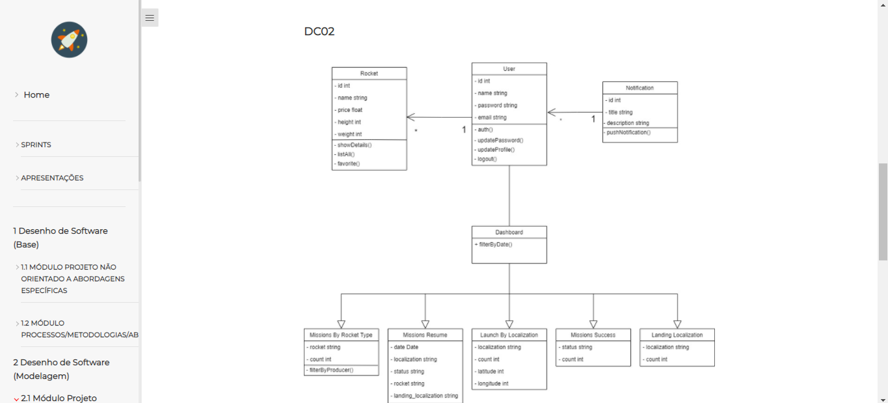
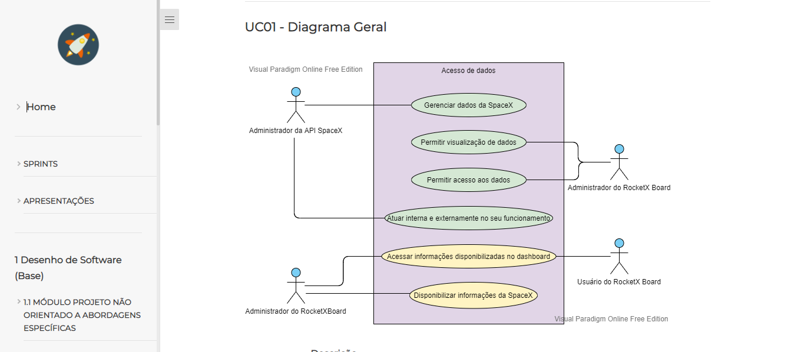
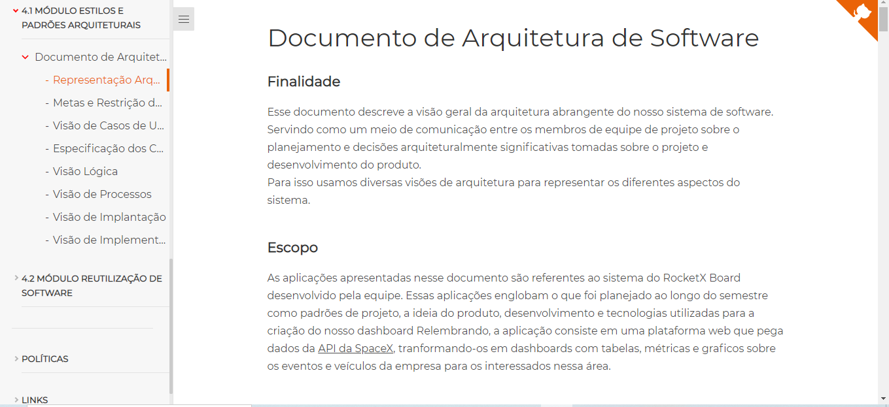
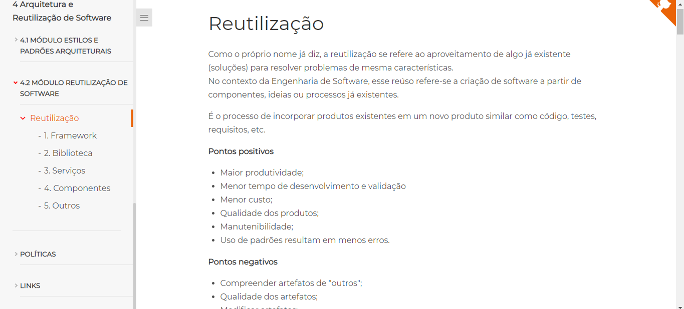
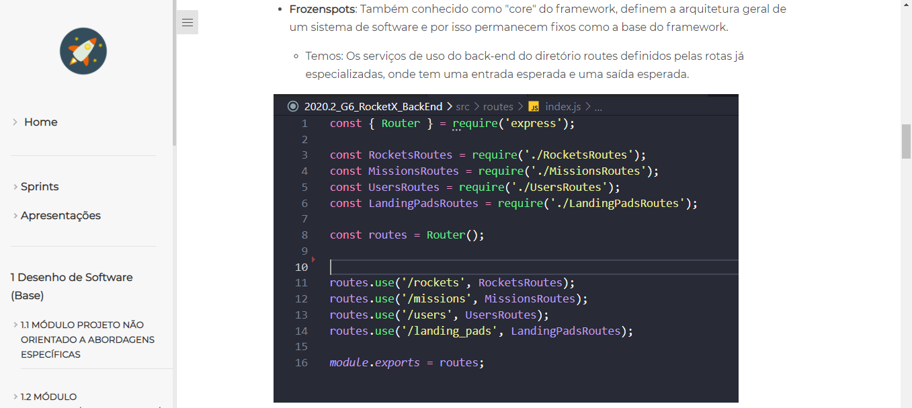

# RocketX Board

**Código da Disciplina**: FGA0208 
**Número do Grupo**: 06 

## Alunos
|Matrícula | Aluno | GitHub
| -- | -- | :--: |
| 16/0022673  | Ailamar Alves Guimarães | [@ailamaralves](https://github.com/ailamaralves)
| 16/0124484  | Heron Rodrigues Sousa | [@heronsousa](https://github.com/heronsousa)
| 16/0125162  | Ingrid da Cruz Galvao dos Santos Soares | [@ingrdst](https://github.com/ingrdst)
| 17/0080307  | Matheus Amaral Moreira | [@Matheus-AM](https://github.com/Matheus-AM)

## Sobre 
Pensando em facilitar de forma visual os dados existentes na API da SpaceX, que é uma empresa norte americana de sistemas aeroespaciais e de serviços de transporte espacial sediada em Hawthorne, Califórnia, nosso time pensou em algo que permitisse aos interessados nos lançamentos e eventos da empresa, uma plataforma mais interessante visualmente com os dados distribuidos em um dashboard 

## Screenshots Primeira Entrega <<FOCO: DSW(Base)>>
***Figura 1: Homepage.*** 
 

 
 

***Figura 2: descrição do projeto.*** 
 

 
 

***Figura 3: Design Sprint.***
 

 
 

***Figura 4: Página Rich Picture.***
 

 

 

## Vídeo(s) Primeira Entrega <<FOCO: DSW(Base)>>

### Vídeo: [Base](https://youtu.be/a5TF41zFHKc) 
### Vídeo: [Metodologia](https://youtu.be/KYMqzscSlbw)

## Screenshots Segunda Entrega <<FOCO: DSW(Modelagem)>>
***Figura 1: Diagrama de classe.***
 

 
 

***Figura 2: Diagrama de casos de uso.***
 

 
 

## Vídeo(s) Segunda Entrega <<FOCO: DSW(Modelagem)>>
### Vídeo: [Diagramas dinâmicos](https://youtu.be/s97SNdBE_K0) 
### Vídeo: [Diagramas estáticos](https://youtu.be/K8PRNA45TG8) 

## Screenshots Terceira Entrega <<FOCO: DSW(Padrões de Projeto)>>
Adicione 2 ou mais screenshots do projeto em termos de artefatos da Terceira Entrega.

## Vídeo(s) Terceira Entrega <<FOCO: DSW(Padrões de Projeto)>>
Adicione o(s)s vídeo(s) da Terceira Entrega.

## Screenshots Quarta Entrega (FINAL) <<FOCOS: Arquitetura & Reutilização de Software & PROJETO FINAL>>

>>
***Figura 1: Documento de arquitetura.***
 

 
 

***Figura 2: Reutilização.***
 

 
 

***Figura 3: Frozenspot.***
 

 
 

## Vídeo(s) Quarta Entrega (FINAL) <<FOCOS: Arquitetura & Reutilização de Software & PROJETO FINAL>>
[4.1 MÓDULO ESTILOS E PADRÕES ARQUITETURAIS](https://drive.google.com/drive/u/0/folders/1SpOvRGKD3YbwfFInvkv2yZLJP3sVvnj2)  
[4.2 MÓDULO REUTILIZAÇÃO DE SOFTWARE](https://drive.google.com/drive/u/0/folders/1SpOvRGKD3YbwfFInvkv2yZLJP3sVvnj2)

## Descritivo dos Principais Aspectos Técnicos 
**Principal(is) Metodologia(s) Adotada(s)**: SCRUM 
**Principais Linguagens Utilizadas e/ou Pretendidas**: Java Script 
**Principais Tecnologias Utilizadas e/ou Pretendidas**: React JS, Node JS 
**Principal(is) Estilo(s) Arquitetural(is) Adotado(s)**: MVC 

## O Projeto está rodando?
( ) SIM  
( x ) NÃO  
Se SIM, insira um manual (ou um script) para auxiliar ainda mais os interessados em consultar o projeto.

## Informações Complementares 
Quaisquer outras informações sobre seu projeto podem ser descritas nessa seção.
