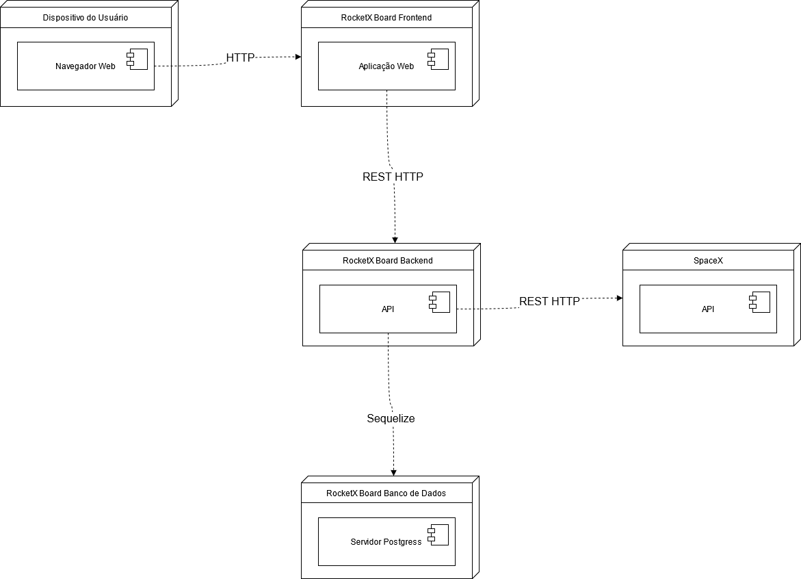
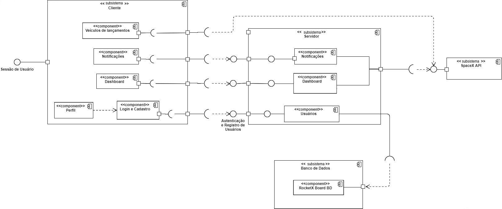

# Documento de Arquitetura de Software

### Finalidade
Esse documento descreve a visão geral da arquitetura abrangente do nosso sistema de software. Servindo como um meio de comunicação entre os membros de equipe de projeto sobre o planejamento e decisões arquiteturalmente significativas tomadas sobre o projeto e desenvolvimento do produto.  
Para isso usamos diversas visões de arquitetura para representar os diferentes aspectos do sistema.

### Escopo

As aplicações apresentadas nesse documento são referentes ao sistema do RocketX Board desenvolvido pela equipe. Essas aplicações englobam o que foi planejado ao longo do semestre como padrões de projeto, a ideia do produto, desenvolvimento e tecnologias utilizadas para a criação do nosso dashboard  Relembrando, a aplicação consiste em uma plataforma web que pega dados da [API da SpaceX](https://github.com/r-spacex/SpaceX-API/tree/master/docs/v4
), tranformando-os em dashboards com tabelas, métricas e graficos sobre os eventos e veículos da empresa para os interessados nessa área.

## Representação Arquitetural

### Uso das Tecnologias

- Frontend:

Para nosso desenvolvimento, pela praticidade da linguagem, pelo escopo do projeto e o conhecimento da equipe em relação às possíveis tecnologias, optou-se pela escolha do *ReactJS* que vem sendo muito utilizado ultimamente por ser uma biblioteca *JavaScript* que facilita na criação de interface para as aplicações web, e também possui uma documentação de fácil acesso para aprendizagem dos conteúdos, caso necessário.

- Backend:

Pelos mesmos critérios definidos para a escolha da tecnologia do Front, optamos para o desenvolvimento do backend algo que fosse eficiente de acordo com a nossa aplicação e fosse conhecido pela maioria dos integrantes. Para isso escolhemos o *NodeJs*. Esse software é bem utilizado para que executar códigos JavaScript no backend dependendo apenas das bibliotecas e dos frameworks usados.

Para a criação do banco de dados foi implementado o MySQL, um sistema de gerenciamento que utiliza a linguagem SQL como interface e é um dos sistemas mais utilizados pelos desenvolvedores.

- Teste:  

Alguns testes iniciais da implementação foram feitos utilizando o Insomnia que é um API Client para suas APIs, gratuito de plataforma cruzada para desktop que facilita na  interação e projeção de APIs baseadas em HTTP.

## Metas e Restrição de Arquitetura

- Metas 

As principais metas estabelecidas para o projeto foram:  

**Segurança:** a plataforma deve manter a segurança nos dados acessados da API, ser segura para os usuários e suas informações e nossos servidores devem garantir a prevenção de qualquer ataque externo.  
**Usabilidade:** é essencial que o sistema possibilite o usuário a realizar as ações rapidamente, intuitivamente, com qualidade e satisfação para que tenhamos cada vez mais o alcançe e aceitação do público.  
**Responsividade:** devido à variedade de dispositivos que temos atualmente, é importante que a plataforma renderize bem em qualquer um dos tamanhos de tela utilizados para o acesso.

- Restrições  

- O desenvolvimento da plataforma deve seguir o planejamento a as tecnologias definidas;
- Para o acesso ao site é necessário a conexão com a internet;
- O site deve poder ser acessado pelos navegadores Chrome, Firefox e Edge;
- Para acesso aos dashboards o usuário deverá criar uma conta.

## Visão de Casos de Uso

## Visão Lógica

A visão lógica tem como objetivo descrever como a organização conceitual do sistema está estruturado de maneira lógica. Para isso, podemos fazer uso de artefatos que demonstrem a estrutura, como os diagramas de classe, de pacote, de colaboração, de interação ou até mesmo de sequência dependendo do caso. De acordo com a complexidade do sistema, ou da necessidade de se explicar especifidades, pode-se usar vários desses documentos, o objetivo é ser o suficiente para compreensão do sistema para quem estiver lendo. No caso, usaremos os diagramas de pacote pois a estruturação do tem a simplicidade para ser explicado por simples diagrama de pacotes.

## Visão de Processos

Nessa parte descrevemos os encadeamentos de controle e os encadeamentos separados que interagem e dependerem uns dos outros.

## Visão de Implantação

### Conexão entre os agentes do sistema

### Acesso às funcionalidades da aplicação de acordo com o status do usuário

## Visão de Implementação

## Visão de Dados

---

### Versionamento

|    Data    | Versão |               Descrição               |     Autor     |
| :--------: | :----: | :-----------------------------------: | :-----------: |
| 20/04/2021 |  0.1   | Criação do documento e escopo inicial | Ailamar Alves |
| ??/04/2021 |  0.2   | - | Heron |
| 25/04/2021 |  0.3   | Adição da introdução e descrições do documento | Ailamar Alves |

 

### Referências

- Aula - Arquitetura&DAS - Parte II. Milene Serrano.Disponível em: <https://aprender3.unb.br/pluginfile.php/639902/mod_label/intro/Arquitetura%20e%20Desenho%20de%20Software%20-%20Aula%20Arquitetura%20e%20DAS%20-%20Parte%20II%20-%20Profa.%20Milene.pdf> Acesso em: abril, 2021.

- Artefato: Documento de Arquitetura de Software. Disponível em: <https://www.cin.ufpe.br/~gta/rup-vc/core.base_rup/workproducts/rup_software_architecture_document_C367485C.html> Acesso em: abril, 2021.
