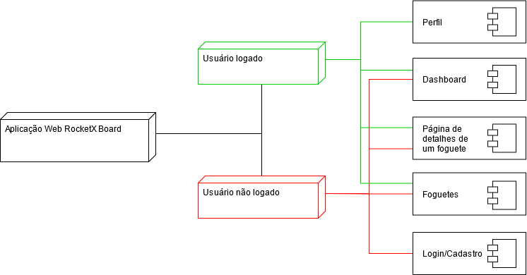

# Documento de Arquitetura de Software

### Representação Arquitetural

### Metas e Restrição de Arquitetura

## Visão de Casos de Uso

## Visão Lógica

## Visão de Processos

## Visão de Implantação

### Conexão entre os agentes do sistema

### Acesso às funcionalidades da aplicação de acordo com o status do usuário

## Visão de Implementação

## Visão de Dados

---

### Versionamento

|    Data    | Versão |               Descrição               |     Autor     |
| :--------: | :----: | :-----------------------------------: | :-----------: |
| 20/04/2021 |  0.1   | Criação do documento e escopo inicial | Ailamar Alves |

 

### Referências

-
