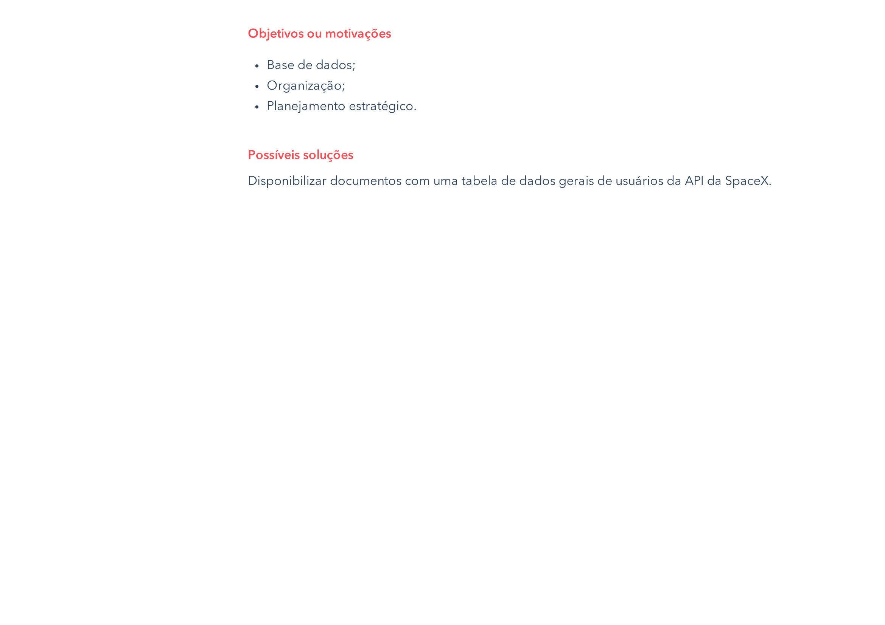
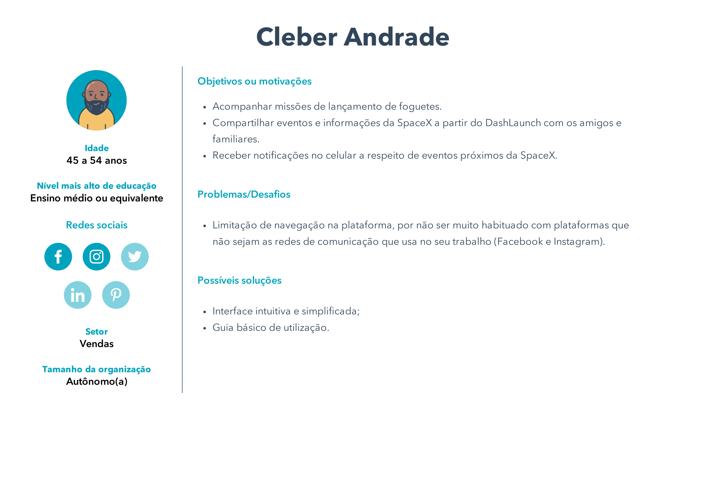

# Personas

Persona é um personagem fictício, baseado em dados de clientes reais, como comportamento, dados demográficos, problemas e objetivos, que representa o cliente ideal para uma aplicação. O uso de personas tem como objetivo criar um perfil que sintetize as principais características dos clientes para que se consiga criar estratégias alinhadas ao público alvo e capazes de atender suas demandas.

## Metodologia

O time decidiu criar personas baseadas em diferentes situações que podem ser abordadas pela aplicação. Para a geração das personas foram utilizados os sites [O Fantástico Gerador de Personas de Marketing](https://geradordepersonas.com.br) e [Ferramenta Faça Minha Persona](https://br.hubspot.com/make-my-persona). Estas personas poderão ser usadas como referências para outras técnicas como Introspecção e Storyboard.

## P1

 

## P2

 

## P3

## Versionamento

|Data|Versão|Descrição|Autor|
|:--------:|:---:|:-------------------: |:-----------------------:|
|18/02/2021| 0.1 | Criação do documento e introdução | Heron Rodrigues |
|18/02/2021| 0.2 | Adição da P1 | Heron Rodrigues |
|18/02/2021| 0.3 | Adição da P2 | Ingrid Soares |
|18/02/2021| 0.4 | Adição da P3 | Ingrid Soares |
 

### Referências

- PEÇANHA, Vitor, Descubra o que é buyer persona e quais os 5 passos essenciais para criar a sua: https://rockcontent.com/br/blog/personas/. Acesso em fev. 2021.