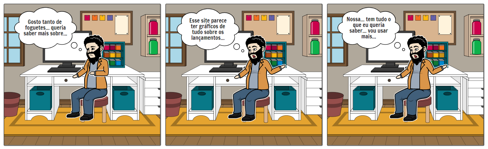
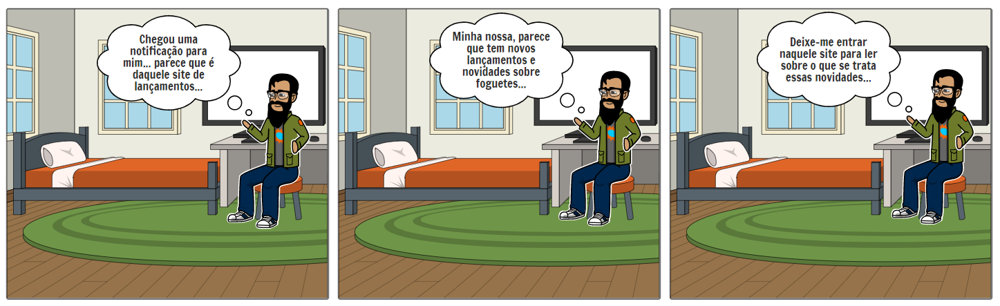

# Storyboard

Storyboard é uma técnica de storytelling, que consiste em contar uma história com uma sequência de quadros. Esses quadros têm como objetivo narrar uma história podendo passar uma breve mensagem de forma visual.
 
## Storyboards
 
### Primeiro contato com o site
Nessa história, o usuário gosta de foguetes e está curioso e ele começa a pesquisar sobre o assunto e se depara com os gráficos sobre o último lançamento de foguete.
 

 
 
### Recebendo notificações do site
Nessa história, o usuário já é cadastrado no site e recebe notificações sobre um novo lançamento.
 

## Requisitos elicitados:

|Descrição|Prioridade|
|:-------------------:|:------------:|
|Os gráficos devem possuir os dados mais relevantes possíveis| should 
|As informações disponíveis devem seguir o interesse do público alvo| must 
|Usuário deve ser notificado com novidades, curiosidades e demais conteúdos| should 

---

## Versionamento

|Data|Versão|Descrição|Autor|
|:--------:|:---:|:-------------------:|:------------:|
|19/02/2021| 0.1 | Criação do escopo do documento| Matheus Amaral 
|19/02/2021| 0.2 | Adição de duas histórias| Matheus Amaral 
|07/03/2021| 0.3 | Adição da tabela de requisitos elicitados | Heron Rodrigues |
  
 

## Referências

* Storyboard That: https://www.storyboardthat.com. Último acesso em 18/02/2021.