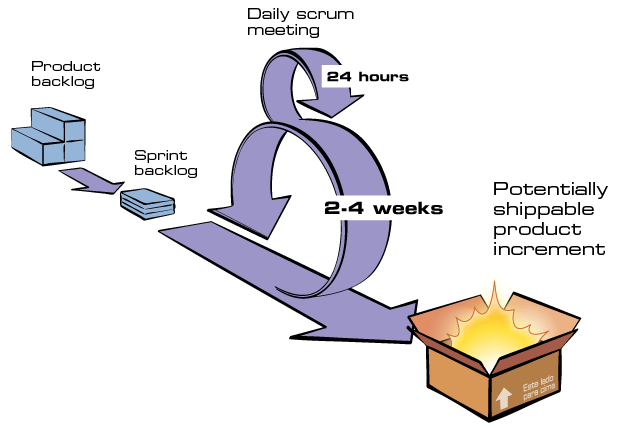

# Metodologia

## Introdução

Esse documento tem o objetivo de descrever métodos e técnicas de metodologias, processos e práticas, de acordo com o objetivo da equipe e da disciplina, utilizadas durante o processo de desenvolvimento do projeto. Além de especificar as ferramentas utilizadas para organização e comunicação da equipe.

## Metodologias Ágeis

Para o desenvolvimento do projeto, foi decidido que seriam utilizadas diferentes metodologias de forma híbrida, usando a combinação das ferramentas que mais se aplicam ao contexto do time e do projeto. Nossa base é a metodologia Scrum, com algumas práticas do XP e do Kanban.

- **Scrum:** Framework que visa a entrega de valor para o produto no menor tempo possível. Não serão assumidos papéis específicos, geralmente utilizados nesta metodologia como, Scrum Master, Product Owner, ...  
- **Kanban:** Modelo visual do fluxo de trabalho da equipe, sendo possível a identificação das tarefas, através de cartões, e seu estado atual. Utilizamos o ZenHub para realizar esse gerenciamento do projeto..
- **XP (Extreme Programming):** Metodologia focada no desenvolvimento de software a partir de um conjunto de práticas, sendo adaptável a times pequenos com diferentes níveis de conhecimento.

### Scrum

***Figura 1: Esquema método Scrum.***
  
***Fonte: https://www.desenvolvimentoagil.com.br/scrum/.***

- **Sprint:** Na metodologia Scrum os projetos são divididos em ciclos que são chamados de Sprints. Esses ciclos correspondem ao tempo em que um conjunto de atividades deve ser executado.
- **Sprint Planning:** É realizada no início de cada Sprint, ou seja, uma reunião de planejamento na qual são priorizados os itens do Product Backlog e a equipe seleciona as atividades que serão implementadas durante o Sprint da semana.
- **Sprint Review:** Nesta parte da reunião o time tem o feedback do que foi alcançado durante a Sprint, assim o projeto é avaliado em relação aos objetivos esperados da Sprint Planning anterior.
- **Daily Meeting:** É uma reunião diária que busca atualizar o time sobre o que foi feito no dia anterior, se há algum impedimento para os integrantes e quais serão as atividades executadas no dia.
- **Product Backlog:** Possui a lista de todas as funcionalidades e atividades necessárias para o produto final, podendo ser atualizado durante o desenvolvimento. Essa lista é utilizada na divisão e escolha de tarefas para as Sprints.

### Kanban

- **Backlog:** Listagem com todas as tarefas a serem realizadas, monitoradas através de issues.
- **In Progress:** Tarefas que estão sendo desenvolvidas no momento.
- **Review:** Tarefas que foram abertas para revisão de um dos membros da equipe através de um Pull Request.
- **Done:** As issues que já foram desenvolvidas e revisadas e tiveram seu PR aceito.

### XP

- **Pair Programming:**  Todo o código desenvolvido no projeto seja sempre implementado por 2 pessoas, onde a ideia é que as duas pessoas estejam juntas desenvolvendo e estejam utilizando apenas 1 computador. Esta técnica é utilizada, pois a programação por pares tem vários benefícios, como por exemplo, a detecção de bugs, pois fica mais fácil de ver quando os 2 estão juntos e simplicidade , pois existe a oportunidade de conversar e trocar ideias de qual o melhor jeito daquilo ser desenvolvido, entre vários outros benefícios.
- **Refactoring:** Refatorar o código fonte com o objetivo de melhorar sua estrutura mas que não altere o comportamento do software.
- **Código coletivo:** Todos têm permissão para modificar o código fonte. O objetivo é fazer a equipe conhecer todas as partes do sistema.
- **Code Reviews:** A revisão de código é feita pelos membros não participantes da issue entregue e avalia se os critérios pré-definidos para a conclusão da tarefa foram atingidos.

## Reuniões 

As reuniões ficaram definidas de acordo com a metodologia adotada, acontecendo uma vez por semana, sendo o começo de uma nova Sprint assim com novas tarefas passadas aos membros. De acordo com os horários em comum disponíveis ao grupo, elas acontecem nas **terças-feiras às 19 horas**. Caso haja algum imprevisto por parte de alguém é possível que seja adiantada/adiada enviado uma mensagem aos outros membros e verificado se todos têm a mesma disponibilidade.

## Ferramentas

|    |    |
---- |:--- 
 | [**GitHub:**](https://github.com/) Utilizado para controle de versão e backup de toda documentação e também desenvolvimento do projeto.
 | [**Telegram:**](https://telegram.org/) Utilizado para comunicação entre os membros da equipe.
 |[**Google Drive:**](https://www.google.com.br/drive/apps.html) Utilizado para o compartilhamento de determinados documentos, permitindo a contribuição de todos os integrantes do grupo.
 | [**Zenhub:**](https://www.zenhub.com/) Utilizado como KanBan do projeto, para gerenciamento das issues.
 | [**Discord:**](https://discord.com/) Ferramenta para a realização das reuniões de plannings, reviews, dailys e pareamentos.
 | [**Microsoft Teams:**](https://www.microsoft.com/pt-br/microsoft-365/microsoft-teams/free) É utilizado para ensaios e gravação das apresentações.

## Regras de contribuição

Para quem deseja contribuir com nosso projeto deve-se seguir o padrão, previamente estabelecido, no documento de [Políticas](https://unbarqdsw2020-2.github.io/2020.2_G6/#/pages/policy/policies). Nesse documento possui as normas de contribuição e padrões do projeto. 

---

## Versionamento

|Data|Versão|Descrição|Autor|
|:--------:|:---:|:-------------------:|:-----------------------:|
|18/02/2021| 0.1 | Criação do documento | Heron Rodrigues
|18/02/2021| 0.2 | Adição de Ferramentas e Reuniões | Ailamar Alves

## Referências

- ESPINHA, Roberto Gil, Kanban O que é e TUDO sobre como gerenciar fluxos de trabalho. Disponível em: <https://artia.com/kanban/>. Acesso em fev 2021.
- Product Backlog: gestão ágil com Scrum. Disponível em: <DesenvolvimentoAgil.com.br>. Acesso em fev 2021.
- Extreme Programming. Disponível em <https://www.devmedia.com.br/extreme-programming-conceitos-e-praticas/1498>. Acesso em fev 2021.