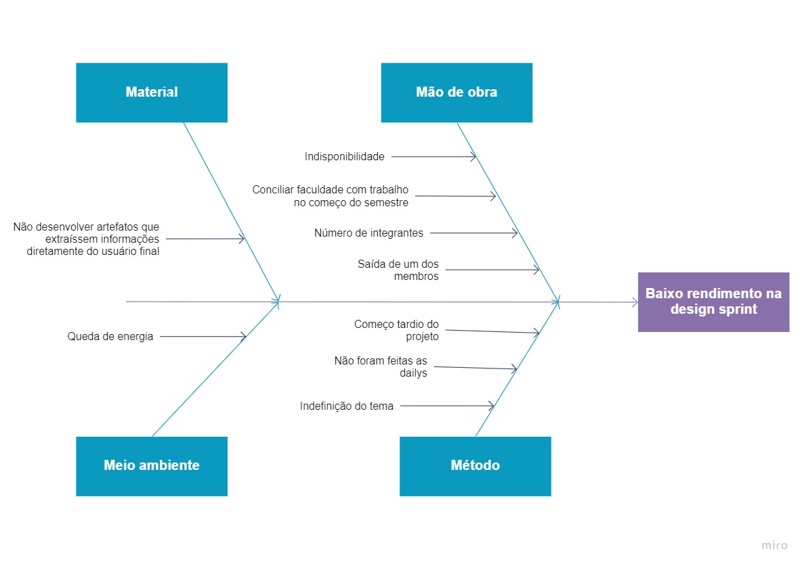

# Diagrama de Ishikawa

O Diagrama de Ishikawa, ou Diagrama de Causa e Efeito, é um artefato utilizado para identificar as causas reais de um problema específico. Ele explora o problema principal de forma a montar uma árvore de subproblemas que são a causa do efeito encontrado, chegando a uma solução mais completa pra questão abordada.

## DI1

 

## Versionamento

|Data|Versão|Descrição|Autor|
|:--------:|:---:|:-------------------: |:-----------------------:|
|18/02/2021| 0.1 | Criação do documento e introdução | Heron Rodrigues |
|18/02/2021| 0.1 | Adição do DI1 | Heron Rodrigues |

 

### Referências

- 02d - VídeoAula - DSW - Base - Causa-Efeito. Milene Serrano. Disponível em: <https://unbbr-my.sharepoint.com/personal/mileneserrano_unb_br/_layouts/15/onedrive.aspx?id=%2Fpersonal%2Fmileneserrano%5Funb%5Fbr%2FDocuments%2FArqDSW%20%2D%20V%C3%ADdeosOriginais%2F02d%20%2D%20VideoAula%20%2D%20DSW%2DBase%20%2D%20Causa%2DEfeito%2Emp4&parent=%2Fpersonal%2Fmileneserrano%5Funb%5Fbr%2FDocuments%2FArqDSW%20%2D%20V%C3%ADdeosOriginais&originalPath=aHR0cHM6Ly91bmJici1teS5zaGFyZXBvaW50LmNvbS86djovZy9wZXJzb25hbC9taWxlbmVzZXJyYW5vX3VuYl9ici9FZXZieFloa3NRRkR0dFFfVEppdlNoUUJMTEJFc2EyNmFZU0FRbGFKLXd4RnF3P3J0aW1lPVlmN2JaR1BVMkVn>. Acesso em fev. 2021.

- ANDRADE, Luiza, Diagrama de ishikawa: O que é e como fazer, 2017. Disponível em: <https://www.siteware.com.br/blog/metodologias/diagrama-de-ishikawa/#Exemplos_de_Diagrama_de_Ishikawa>. Acesso em fev. 2021.

- Diagrama de Ishikawa (Ferramenta da Qualidade): Teoria + Exemplo Prático. Disponível em: https://www.youtube.com/watch?v=U-0qzmFqH-0&ab_channel=AprendendoGest%C3%A3o. Acesso em fev 2021