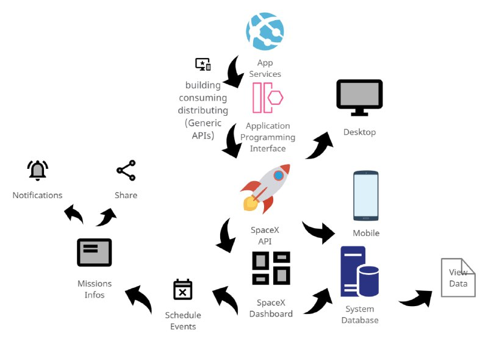

# Rich Picture

O Rich Picture é uma técnica que gera um artefato de grau inferior de formalidade, que busca construir pré-rastreabilidade através de desenhos ou diagramas, feitos a mão ou digitalmente, expressando ideias ou funcionalidades e relações entre sistemas e subsistemas. Justamente por ser menos formal, muitas vezes servindo para transparecer a compreensão do problema através da visão dos vários envolvidos, que podem ajudar na criação dos diagramas sem precisar de nenhum conhecimento prévio.

## Metodologia

A metodologia adotada pelo grupo para o desenvolvimento dos Rich Pictures consiste em que cada integrante monte um artefato representando o funcionamento geral da aplicação.

## RP1 

## RP2 

## RP3

## Versionamento

|Data|Versão|Descrição|Autor|
|:--------:|:---:|:-------------------: |:-----------------------:|
|17/02/2021| 0.1 | Criação do documento e introdução | Heron Rodrigues |
|17/02/2021| 0.2 | Adição do [RP1](#rp1) | Heron Rodrigues |
|17/02/2021| 0.3 | Adição do [RP2](#rp2) | Matheus Amaral |
|17/02/2021| 0.4 | Adição do [RP3](#rp3) | Ingrid Galvão |

 

### Referências

- 02c - VídeoAula - DSW - Base - RichPicture. Milene Serrano. Disponível em: <https://unbbr-my.sharepoint.com/personal/mileneserrano_unb_br/_layouts/15/onedrive.aspx?id=%2Fpersonal%2Fmileneserrano%5Funb%5Fbr%2FDocuments%2FArqDSW%20%2D%20V%C3%ADdeosOriginais%2F02c%20%2D%20VideoAula%20%2D%20DSW%2DBase%20%2D%20RichPicture%2Emp4&parent=%2Fpersonal%2Fmileneserrano%5Funb%5Fbr%2FDocuments%2FArqDSW%20%2D%20V%C3%ADdeosOriginais&originalPath=aHR0cHM6Ly91bmJici1teS5zaGFyZXBvaW50LmNvbS86djovZy9wZXJzb25hbC9taWxlbmVzZXJyYW5vX3VuYl9ici9FZVM2RVQ4bDFEVkx1QTVqc1hfbzU0Y0JMWGRDdDRadGNETkFDZ2hfUlFBVmh3P3J0aW1lPS1xbmhwcGZUMkVn>. Acesso em fev. 2021.

- Lewis, P. Rich picture building in the soft systems methodology. Eur J Inf Syst 1, 351–360 (1992). Dinponivel em: <https://doi.org/10.1057/ejis.1992.7>. Acesso em fev. 2021.