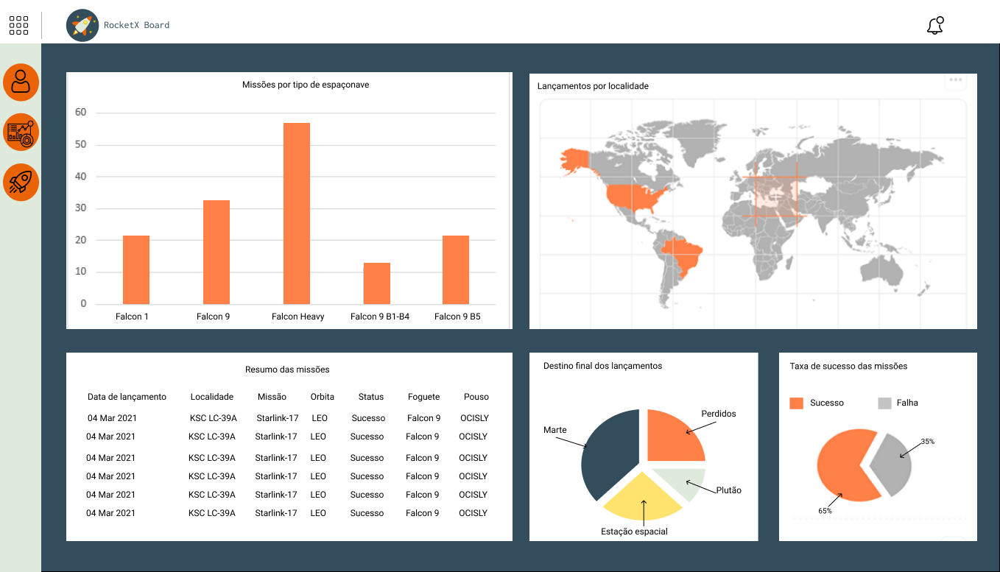
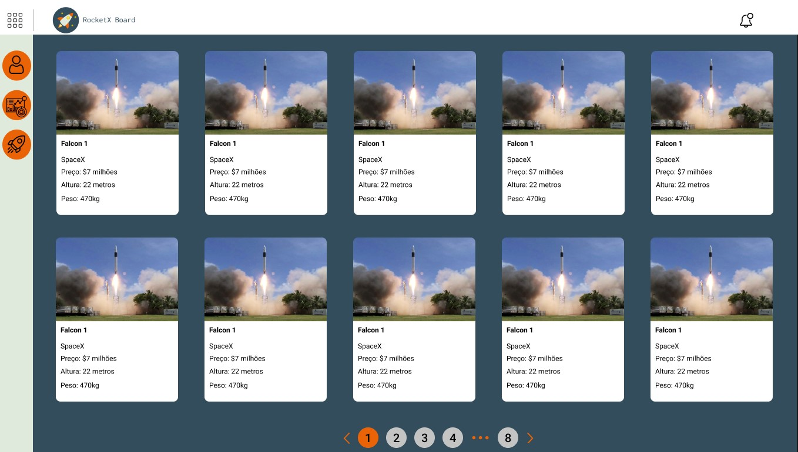

# Protótipo

Com base nos requisitos gerados a partir dos artefatos desenvolvidos durante a [Design Sprint](/designsprint.md), foi realizado pela equipe o protótipo de alta fidelidade da aplicação. Possibilitando um maior entendimento do software e servindo de base para os demais artefatos que serão gerados a partir de então. 

## Metodologia

Para o desenvolvimento do portótipo foi utilizado a ferramenta [Figma](https://www.figma.com/). A elaboração do protótipo ocorreu durante uma reunião realizada pela equipe no [Discord](https://discord.com/). 

Com base nos dados que estão disponibilizados na [SpaceXAPI](https://docs.spacexdata.com/), o time decidiu mapear os possíveis gráficos para serem abordados na aplicação: Missões por tipo de espaçonaves, Lançamentos por localidade, Resumo das missões, Destino final dos lançamentos e Taxa de sucesso nas missões.

## Protótipo de Alta Fidelidade

---

## Versionamento

|Data|Versão|Descrição|Autor|
|:--------:|:---:|:-------------------:|:------------:|
|05/03/2021| 0.1 | Criação do escopo do documento| Heron Rodrigues 
|05/03/2021| 0.1 | Adição do P01| Ailamar Alves Heron Rodrigues Ingrid Soares Matheus Amaral
|06/03/2021| 0.1 | Adição do P01| Heron Rodrigues
  
 

### Referências

- IBRAGIMOVA, Eleonora. High-fidelity prototyping: What, When, Why and How?. 28 de dezembro de 2016. Disponível em: https://blog.prototypr.io/high-fidelity-prototyping-what-when-why-and-how-f5bbde6a7fd4. Acesso em: mar. 2021.
