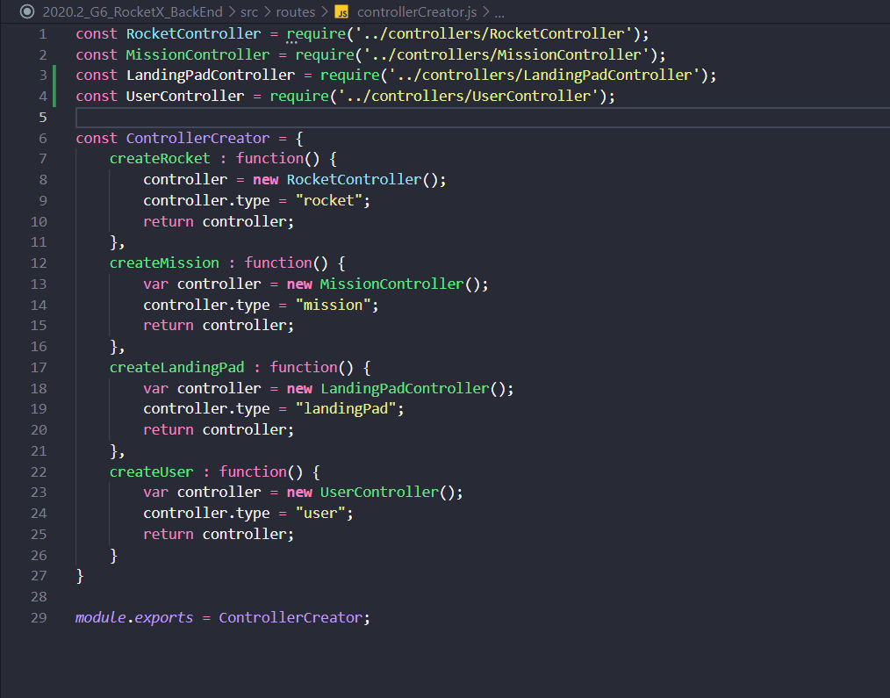
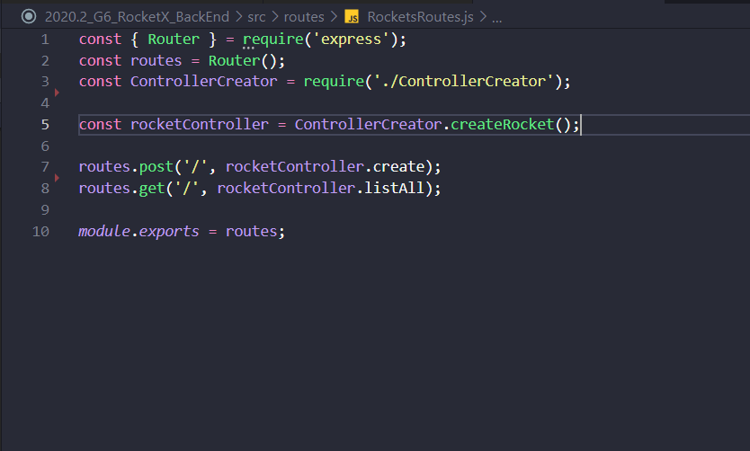
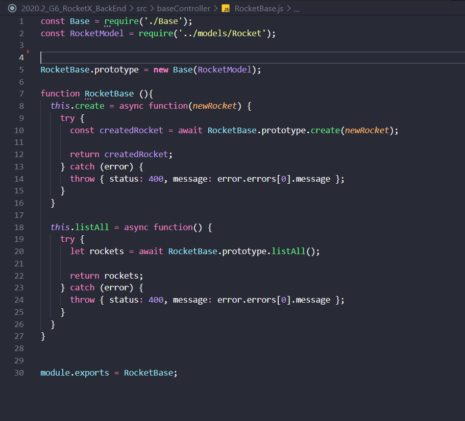

# Aplicação - GoF Criacional
 
Os padrões GoF Criacionais foram feitos pensando na programação orientada a objetos. Portanto, nós pegamos os princípios de alguns padrões e adaptamos para aplicar no nosso projeto em JavaScript que, por mais que tenha suporte a escrita de classes, é uma linguagem orientada em cadeias de protótipos.
 
## Factory Method
O princípio do Factory Method consiste em construir uma classe criadora das outras classes em um nível abstrato do objeto, para delegar as instâncias para as subclasses específicas. Tendo isso como objetivo, nós criamos um objeto ControllerCreator com o objetivo de conter nela a assinatura das possíveis instâncias de uma controller () para que quando uma parte do código precisar instanciar uma controller, precise passar por ela. 
 
Vale ressaltar também que o padrão foi adaptado para ser feito sem sobrescrita e abstração de classe porque o JavaScript não se dá muito bem com isso em questão de desempenho, pois nele existe a imutabilidade dos objetos, ou seja, ao tentar criar classes abstratas para se especificarem depois, você cria instâncias de objetos que vão ser movidos para coleção de memória não usada, e a cada vez que se instanciar um novo objeto concreto, o protótipo do objeto abstrato vai clonado próximo ao final da cadeia de protótipos. Portanto, aumentar a cadeia de protótipos deve ser feita com consciência.
    
 
## Singleton
A princípio, o Singleton é um padrão onde uma classe só pode ter uma única instância, tendo que se regular o uso para isto. No caso tivemos duas ocorrências desse padrão, uma no uso do Sequelize e outra para o uso das controllers, contendo uma instância única para todas as atividades. No caso do JavaScript, ele funciona com uma fila imutável de atividades, onde foi feito o uso de funções assíncronas que fazem com que a próxima atividade da fila só possa ser iniciada após o término da atividade descrita com o await, ou a ocorrência de um timeout.
 
## Prototype
Para qualquer projeto em JavaScript o Prototype é o padrão de projeto mais importante, pois como já dito anteriormente, JavaScript é uma linguagem que a hierarquia é orientada por cadeias de protótipos. Então, toda abstração do uso de classes ou até mesmo objetos globais do JavaScript estão usando o princípio do Prototype juntamente com a complexidade do encadeamento deles. Portanto, por mais que não tenha sido implementado de fato, o uso do padrão Prototype é inato do JavaScript. Para evidenciar isso, trocamos a escrita de classes adicionada no ECMAScript 2015 pela escrita de cadeias de protótipos. 
 
### Imagem 1: Factory

 

### Imagem 2 Singleton e uso do Factory

 
 

### Imagem 3 Prototype e await do Singleton

 
 
 
 
### Versionamento
 
| Data | Versão | Descrição | Autor |
|:----:|:-----: |:---------:|:-----:|
| 08/03/2021 | 0.1 | Adicionando aplicação dos padrões criacionais  | Matheus Amaral  
| 08/03/2021 | 0.2 | Adicionando sobre as adaptações para o JavaScript  | Matheus Amaral 
| 08/03/2021 | 0.3 | Adicionando imagens dos padrões criacionais em código | Matheus Amaral
| 09/03/2021 | 0.4 | Revisão do documento | Heron Rodrigues
 
 
 
## Referências
 
* Sobre JavaScript - https://developer.mozilla.org/pt-BR/docs/Web/JavaScript

* Slide: Aula - GOFS CRIACIONAIS, Profa. Milene Serrano
