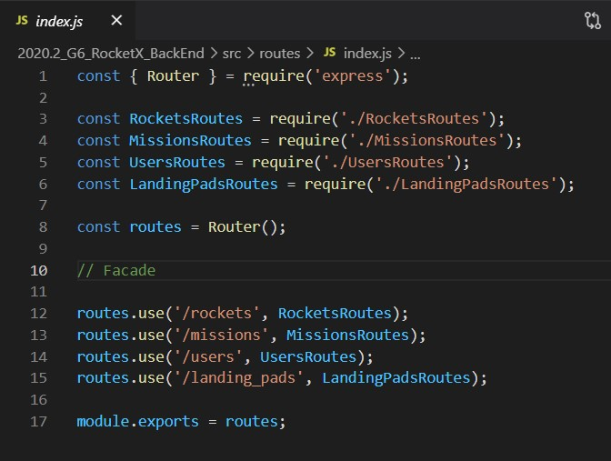
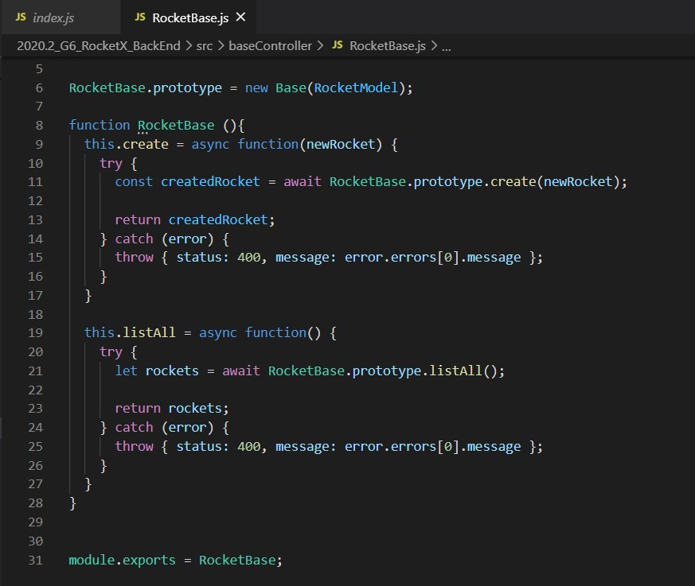
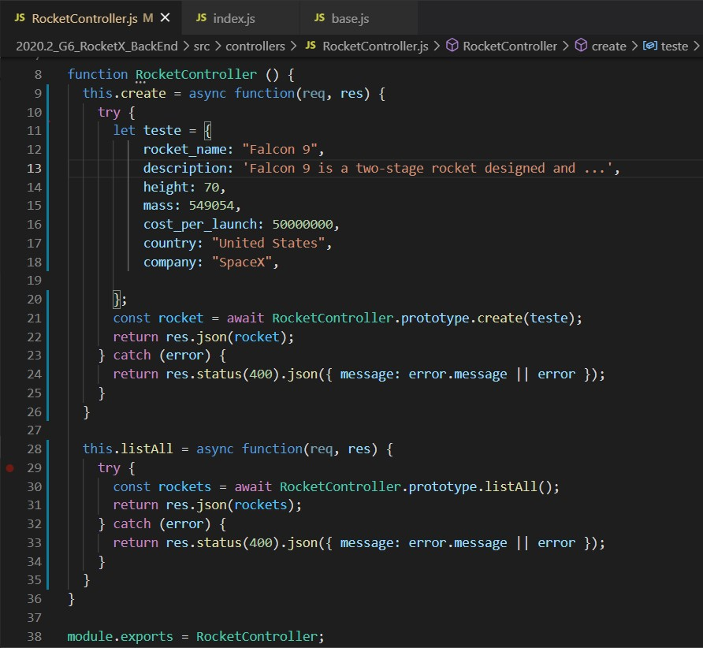

# Aplicações GoF Estrutural

Após o [Treinamento](https://unbarqdsw2020-2.github.io/2020.2_G6_RocketX/#/pages/design_patterns/patterns?id=o-que-%c3%a9-padr%c3%a3o-de-projeto-) e definição de cada método, utilizamos os que mais se encaixavam no escopo do nosso projeto para executar essas aplicações.

## Facade

Exemplo da aplicação: 

  Fig 1: Uso do facade.

Arquivo completo: [index.js](https://github.com/UnBArqDsw2020-2/2020.2_G6_RocketX_BackEnd/blob/main/src/routes/index.js)

## Decorator

Exemplo das aplicações: 

  Fig 2: Uso da decorator.

Arquivo completo: [RocketBase.js](https://github.com/UnBArqDsw2020-2/2020.2_G6_RocketX_BackEnd/blob/main/src/baseController/RocketBase.js)

  Fig 3: Uso da decorator.

Arquivo completo: [RocketController.js](https://github.com/UnBArqDsw2020-2/2020.2_G6_RocketX_BackEnd/blob/main/src/controllers/RocketController.js)

---

### Versionamento

|Data|Versão|Descrição|Autor|
|:--:|:----:|:-------:|:---:|
|06/04/2021| 0.1 | Criação do documento e adição das figuras | Ailamar Alves

 

### Referências 
 - AULA - GRASP – PARTE I. Milene Serrano. Disponível em: <https://aprender3.unb.br/pluginfile.php/639891/mod_label/intro/Arquitetura%20e%20Desenho%20de%20Software%20-%20Aula%20GRASP%20BASE%20Parte%20I%20-%20Profa.%20Milene.pdf> . Acesso em: abr, 2021.

