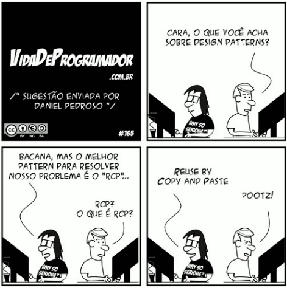

# Treinamento Padrões de Projeto

## O que é padrão de projeto ?
- Padrão de porjeto consiste em uma solução boa, testada e aprovada para um problema recorrente, em outras palavras:  
	“... descreve um problema que ocorre repetidamente em nosso
	ambiente e, em seguida, descreve o núcleo da solução para esse 
	problema, de forma que você possa usar esta solução um milhão 
	vezes, sem nunca fazer da mesma forma duas vezes ”
	(Alexander, 1977)

## Padrão de projeto em Software
- Padrões de projeto são princípios e soluções usados durante a criação do software, codificados em um formato estruturado, descrevendo o problema e a respectiva solução adotada;
- Codificam o conhecimento existente, de forma que possa ser reaplicado em contextos diferentes, além de aprimorar a comunicação entre os desenvolvedores (Figura 1);
- Tornam projetos OO mais flexíveis, elegantes e reusáveis.

 

    
  Figura 1: Padrões de projeto (www.ic.uff.br)

Padrões estudados e utilizados no projeto:

- [GRASP](/pages/design_patterns/trainning-grasp.md)
- [GoF Estrutural]()
- [GoF Criacinal]()
- [GoF Comportamental]()

---

### Versionamento

|Data|Versão|Descrição|Autor|
|:--:|:----:|:-------:|:---:|
|22/03/2021| 0.1 | Criação do documento e resumo inicial | Ailamar Alves
|29/03/2021| 0.2 | Complementando a explicação dos tópicos | Heron Rodrigues

 

### Referências 
 - AULA - GRASP – PARTE I. Milene Serrano. Disponível em: <https://aprender3.unb.br/pluginfile.php/639891/mod_label/intro/Arquitetura%20e%20Desenho%20de%20Software%20-%20Aula%20GRASP%20BASE%20Parte%20I%20-%20Profa.%20Milene.pdf> Acesso em: mar, 2021