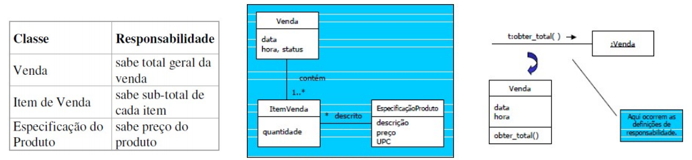

# Padrão GRASP (General Responsability Assignment Software Patterns) 

Os Padrões de Software para Atribuição de Responsabilidade Geral
foram criados com o intuito de tornar o código mais flexível, facilitando a manutenção e a extensibilidade.  
Auxiliam os desenvolvedores a projetar de uma forma bem estrutura aplicações orientadas a objetos. São classificados nos nove tipos principais abaixo:

## GRASP Criador

Diagrama menos detalhado que o diagrama de classes. Define quais classes possuem a responsabilidade de criar instâncias.
Pontos importantes que devem ser levados em conta pois nem sempre o raciocínio é válido ao modelar ao usando como base o paradigma de OO:  
	• B “contém” A ou é uma composição de A.  
	• B registra A.  
	• B usa A de maneira muito próxima.  
	• B tem dados iniciais de A, os quais serão passados para A quando este for criado. B é um “especialista” em relação à criação de A.

## GRASP Especialista

Se preocupa em atribuir responsabilidades para a entidade mais especificas em um dado aspecto e não apenas de criação de instâncias: Quem é a melhor entidade para calcular algo? Quem é a melhor para ordenar algo? Quem é a melhor entidade para cadastrar algo?  
Isso evita que o software tenha um forte acoplamento, a partir do momento em que os controladores teriam lógicas além do necessário, além de sua responsabilidade.

    
  Figura 1: Modelo conceitual parcial (www.ic.uff.br)

**Em resumo:**

- É o padrão mais usado para atribuir responsabilidades;
- A informação necessária frequentemente está espalhada em vários objetos e mensagens são usadas para estabelecer colaborações;
- O resultado final é diferente do mundo real (certas partes diagramadas seriam feitas por pessoas);
- Encapsulamento mantido (objetos usam sua própria informação para cumprir responsabilidades);
- Fraco acoplamento entre objetos e sistemas mais robustos/fáceis de manter;
- Alta coesão (objetos fazem tudo que é relacionado à sua própria informação).

## GRASP Controladora

Atribui a responsabilidade de lidar com os eventos do sistema para uma classe que representa a um cenário de caso de uso do sistema global.

**Observações de construção:**
- Usar o mesmo controlador para todos os eventos do sistema no mesmo caso de uso;
- Um evento do sistema é gerado por um ator;
- Um controlador não deve ter muitos atributos e nem manter informação sobre o domínio do problema;
- Um controlador não deve realizar muitas tarefas, apenas delegá-las Um bom projeto deve dar vida aos objetos, atribuindo-lhes responsabilidades, até mesmo se eles forem seres inanimados;
- A camada de apresentação (interface com o usuário) não deve tratar eventos do sistema.

## GRASP Baixo Acoplamento 

Determina que as classes não devem depender de objetos concretos e sim de abstrações, para permitir que haja mudanças sem impacto. Quanto menor essa dependência, mais manutenível é o nosso software.  
Em resumo, ´para minimizar dependências e maximizar reuso, atribuir a responsabilidade de modo que o acoplamento (dependência entre classes) seja baixo.

## GRASP Alta Coesão

Este princípio determina que as classes devem se focar apenas na sua responsabilidade. Uma classe coesa é uma entidade dedicada a procedimentos específicos. 

Para manter a complexidade sob controle -
classes que fazem muitas tarefas não relacionadas são mais difíceis de entender,
de manter e de reusar, além de serem mais vulneráveis à mudança (baixa coesão) - atribuir uma responsabilidade para que a coesão se mantenha alta.

## GRASP Polimorfismo

As responsabilidades devem ser atribuídas a abstrações e não a objetos concretos, permitindo que eles possam variar conforme a necessidade.

Conceito muito utilizado na Programação Orientada a Objetos, onde o sistema possui duas ou mais classes com métodos parecidos, então é criado uma classe com um nível de abstração mais alto e generalista para que as classes possam herdar as características dessa classe abstrata.

## GRASP Fabricação Própria ou Invenção Pura

É uma classe que não representa nenhum conceito no domínio do problema, ela apenas funciona como uma classe prestadora de serviços, e é projetada para que possamos ter um baixo acoplamento e alta coesão no sistema. Por exemplo, um módulo de persistência no banco de dados.

## GRASP Indireção

Este princípio ajuda a manter o baixo acoplamento, através de delegação de responsabilidades através de uma classe mediadora.

## GRASP Variações Protegidas

Protege o sistema com a variação de componentes, encapsulando o comportamento que realmente importa.

Aplicado juntamente com o polimorfismo, através do uso de interface, e encapsulamento de dados, possibilita um mecanismo de defesa para permitir a flexibilidade e proteção dos elementos contra variações em outras entidades.

---

### Versionamento

|Data|Versão|Descrição|Autor|
|:--:|:----:|:-------:|:---:|
|22/03/2021| 0.1 | Criação do documento e resumo inicial | Ailamar Alves
|29/03/2021| 0.2 | Complementando a explicação dos tópicos | Heron Rodrigues
|29/03/2021| 0.3 | Adição das figuras e esquemas exemplo | Ailamar Alves

 

### Referências 
 - AULA - GRASP – PARTE I. Milene Serrano. Disponível em: <https://aprender3.unb.br/pluginfile.php/639891/mod_label/intro/Arquitetura%20e%20Desenho%20de%20Software%20-%20Aula%20GRASP%20BASE%20Parte%20I%20-%20Profa.%20Milene.pdf> Acesso em: mar, 2021.

 - Padrões de Projeto. Bruna Diirr. Disponível em: <http://www.ic.uff.br/~anselmo/cursos/ProjSoft/apresentacoes/Padroes%20de%20projeto.pdf>. Acesso em: mar, 2021.
