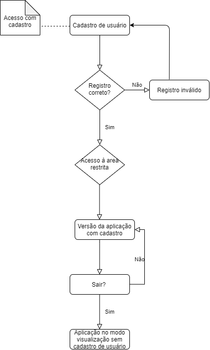
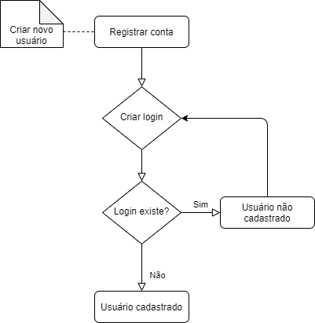
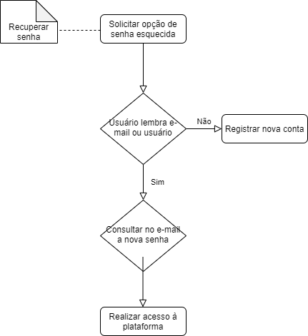

# Diagrama de atividades

O objetivo do diagrama de atividades é permitir a visualização do fluxo de atividades de um único processo. Ele mostra como uma atividade depende uma da outra, com atividades conectadas através de arcos (transições), que mostram as dependências entre elas. Um diagrama de atividade ilustra a natureza dinâmica de um sistema pela modelagem do fluxo de controle de atividade à atividade.

## Metodologia 

Para o desenvolvimento dos esquemas o grupo em geral utilizou ferramentas do [Draw.io](https://app.diagrams.net/)  por já possuir os métodos e design padrão das representações dos diagramas. 
Os diagramas abaixo foram feitos com base em funcionalidades levantadas pela equipe na parte de Elicitação de requisitos.

 
 
## Diagramas 

|   |Descrição|
|:-:|:--------|
|Versão|0.1|
|Autor|Ingrid Soares|
|Descrição| Acesso com cadastro|
|Atores| Usuários |
|Pré-condições| O usuário deve possuir uma conta prévia |
|Fluxo Principal|Realizar acesso ao dashboard por meio do cadastro de usuário, para então visualizar a versão restrita da aplicação, até que saia da conta|
|Fluxo Alternativo| Não há fluxos alternativos|
|Fluxo de Exceções| Não há fluxos de exceções|
|Pós Condições| Ações realizadas, como edição de perfil ou adição de conteúdo à conta, como favoritar evento, ficam salvas na conta do usuário |

 

 
|   |Descrição|
|:-:|:--------|
|Versão|0.1|
|Autor|Ingrid Soares|
|Descrição| Recuperar senha|
|Atores| Usuários |
|Pré-condições| O usuário deve possuir cadastro prévio para solicitar a recuperação de conta, e lembrar do e-mail registrado para receber a nova senha|
|Fluxo Principal| Ao solicitar a opção de senha esquecida, se o usuário lembra do e-mail ou usuário, receberá no e-mail a nova senha. Caso o usuário se não se recorde nem do login e nem do e-mail,deverá registrar uma nova conta.  |
|Fluxo Alternativo| Não há fluxos alternativos|
|Fluxo de Exceções| Não há fluxos de exceções|
|Pós Condições| Nova senha no cadastro ou novo registro para o caso do usuário que não se lembra do e-mail ou nome de usuário. |

 

 
|   |Descrição|
|:-:|:--------|
|Versão|0.1|
|Autor|Ingrid Soares|
|Descrição| Visualizar eventos|
|Atores| Usuários |
|Pré-condições| O usuário deve acessar o dashboard |
|Fluxo Principal| Usuário com cadastro pode visualizar o dashboard no modo restrito, e além de visualizar os eventos com os dados das missões, poderá realizar ações na sua conta pessoal. O usuário sem cadastro consegue apenas compartilhar as atividades e ativar notificações do dashboard.|
|Fluxo Alternativo| Não há fluxos alternativos|
|Fluxo de Exceções| Não há fluxos de exceções|
|Pós Condições| Ações realizadas por usuários com cadastro ficam registradas na sua conta. |

 

 
## Rastreabilidade

| ID | Rastro |
|:--:| :----- |
AD01 |  [Diagrama geral - Léxicos LV1/2/3/4/5/6/7](https://unbarqdsw2020-2.github.io/2020.2_G6_RocketX/#/pages/modeling/lexico) |
AD02 | [Léxicos LV1/2/3](https://unbarqdsw2020-2.github.io/2020.2_G6_RocketX/#/pages/modeling/lexico) |
AD03 | [Léxicos LV-4/5/6/7](https://unbarqdsw2020-2.github.io/2020.2_G6_RocketX/#/pages/modeling/lexico) |
 
 
### Versionamento

| Data | Versão | Descrição | Autor |
|:----:|:-----: |:---------:|:-----:|
| 02/03/2021 | 0.1 | Adicionando Introdução de diagramas de atividade  | Ingrid Soares 
| 02/03/2021| 0.2 | Adicionando diagramas| Ingrid Soares 
| 04/03/2021| 0.3 | Adição de descrição de diagramas, rastreabilidade e versionamento| Ingrid Soares 
 

 
  
 
## Referências
<ul>
<li>
UML | Diagrama de atividades. Disponível em: https://www.ateomomento.com.br/uml-diagrama-de-atividades/
 . Acesso em: 01 de março. 2021.
</li>
<li>
Glossário UML. Disponível em:
https://homepages.dcc.ufmg.br/~amendes/GlossarioUML/glossario/conteudo/atividades/diagrama_de_atividades.htm
 . Acesso em: 01 de março. 2021.
</li>
Exemplo de diagrama. Disponível em:
https://homepages.dcc.ufmg.br/~amendes/GlossarioUML/glossario/conteudo/atividades/diagrama_de_atividades.htm
 . Acesso em: 01 de março. 2021.
</ul>
