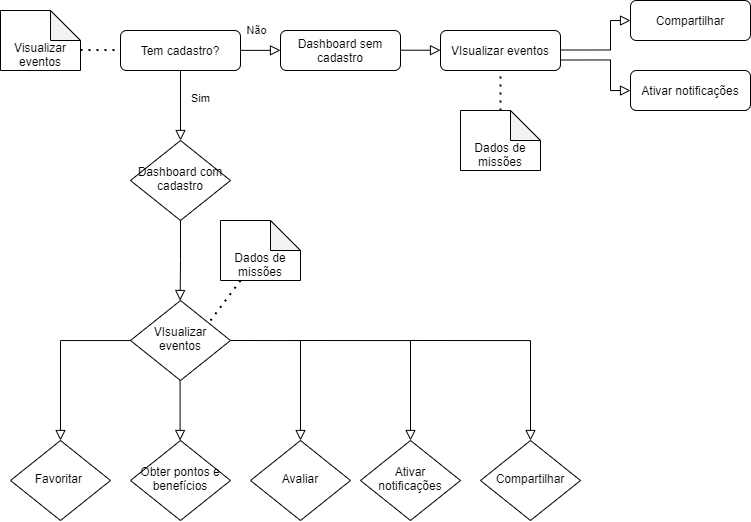

# Diagrama de Atividade
 
## Histórico de Versão
 
<table>
  <thead>
    <tr>
      <th>Data</th>
      <th>Autor(es)</th>
      <th>Descrição</th>
      <th>Versão</th>  
    </tr>
  </thead>
 
  <tbody>
    <tr>
      <td>02/03/2021</td>
      <td>
        Ingrid Soares(<a target="blank" href="https://github.com/ingrdst">Ingrid</a>)
      </td>
      <td>Adicionando Introdução de diagramas de atividade</td>
      <td>0.1</td>
    </tr>
<tr>
      <td>02/03/2021</td>
      <td>
        Ingrid Soares(<a target="blank" href="https://github.com/ingrdst">Ingrid</a>)
      </td>
      <td>Adicionando diagramas</td>
      <td>0.2</td>
    </tr>

    
  </tbody>
</table>
 
## Introdução
 

&emsp;
O objetivo do diagrama de atividades é permitir a visualização do fluxo de atividades de um único processo. Ele mostra como uma atividade depende uma da outra, com atividades conectadas através de arcos (transições), que mostram as dependências entre elas. Um diagrama de atividade ilustra a natureza dinâmica de um sistema pela modelagem do fluxo de controle de atividade à atividade.
 

 
## Diagramas de Atividades

### Autor: [Ingrid](https://github.com/ingrdst)
 

 
### Rastreabilidade
 

 
 
|ID|Descrição|
|--|--|

 
   
 
## Referências
<ul>
<li>
UML | Diagrama de atividades. Disponível em: https://www.ateomomento.com.br/uml-diagrama-de-atividades/
 . Acesso em: 01 de março. 2021.
</li>
<li>
Glossário UML. Disponível em:
https://homepages.dcc.ufmg.br/~amendes/GlossarioUML/glossario/conteudo/atividades/diagrama_de_atividades.htm
</li>
</ul>
