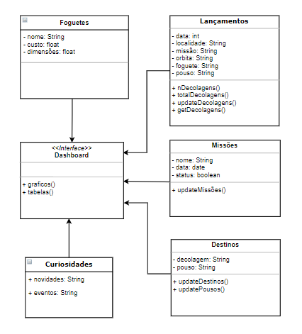

# Diagrama de Classes

Esse diagrama representa a estrutura e relações das classes que servem de modelo para objetos, ou seja, classifica objetos com as mesmas características, facilitando identifica-los e agrupá-los. Essas classes são compostas por seus atributos e métodos.  
É classificado como um diagrama estático que reúne os elementos mais importantes de um sistema orientado a objetos e exibem um conjunto de interfaces e seus relacionamentos.  

## Metodologia

Para o desenvolvimento dos esquemas o grupo optou por utilizar as ferramentas do aplicativo [Draw.io](https://app.diagrams.net/) por já possuir os métodos e design padrão das representações de cada diagrama.  
As UML's de classe, por ser um diagrama essencial e mais complexo, serão feitas com a contribuição da perspectiva de mais de um integrante para que juntando as ideias possa se chegar a um esquema principal, sempre podendo haver novas versões caso necessário.  
Esses foram feitos baseados em funcionalidades estabelecidas para o projeto, como listadas no [Rich Picture](https://unbarqdsw2020-2.github.io/2020.2_G6_RocketX/#/pages/base/preTraceability/richPicture) e com base nos [Requisitos](https://unbarqdsw2020-2.github.io/2020.2_G6_RocketX/#/pages/base/elicitation/introspeccao) levantados. 

## Diagramas

### DC01

---

## Versionamento

|Data|Versão|Descrição|Autor|
|:--------:|:---:|:-------------------:|:------------:|
|24/02/2021| 0.1 | Criação do escopo do documento| Ailamar Alves 
|27/02/2021| 0.2 | Adição de introdução e metodologia | Ailamar Alves 
|03/02/2021| 0.3 | Desenvolvimento e adição da versão DC01 | Ailamar Alves e Matheus Amaral
  
 

### Referências

- UML Class and Object Diagrams Overview. Disponível em: <https://www.uml-diagrams.org/class-diagrams-overview.html>. Acesso em: fev 
2021.
- Aula - Modelagem UML Estática. Milene Serrano. Disponível em: <https://aprender3.unb.br/pluginfile.php/639883/mod_label/intro/Arquitetura%20e%20Desenho%20de%20Software%20-%20Aula%20Modelagem%20UML%20Est%C3%A1tica%20-%20Profa.%20Milene.pdf> Acesso em: fev 2021.
- Orientações básicas na elaboração de um diagrama de classes. Disponível em: <https://www.devmedia.com.br/orientacoes-basicas-na-elaboracao-de-um-diagrama-de-classes/37224>. Acesso em: mar 
2021.
