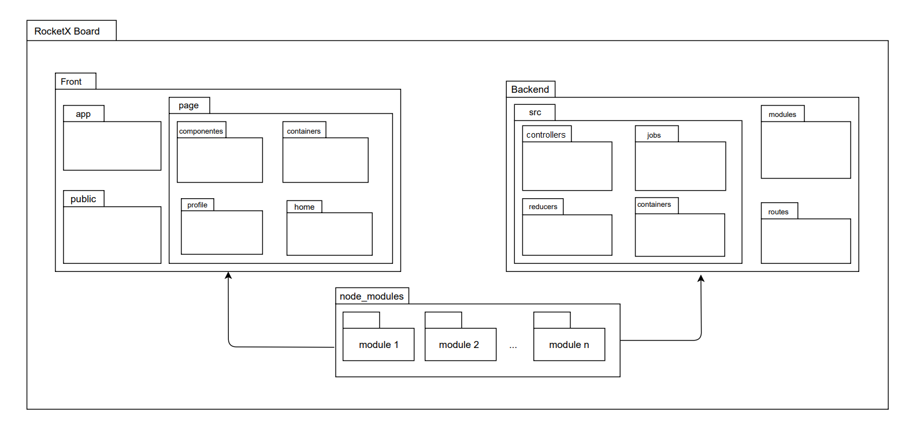

# Diagrama de Pacotes

Na parte de diagrama de pacotes temos um diagrama que mostra a estrutura do sistema projetado no nível de pacotes. Geralmente esses elementos são desenhados em pacotes de dependência, importações de elementos, importação de pacotes, mesclagem de pacote, entre outros. Resumindo, com ele é possível organizar o sistema representando por uma visão em módulos. 

## Metodologia

Para o desenvolvimento dos esquemas o grupo optou por utilizar as ferramentas do aplicativo [Draw.io](https://app.diagrams.net/) por já possuir os métodos e design padrão das representações de cada diagrama.  
Abaixo segue as versões do que se é esperado pelo grupo para a organização dos pacotes do projeto. Esses foram feitos baseados na divisão de pacotes que já são considerados como uma boa forma de se separar arquivos para o desenvolvimento de um software.

## Diagramas

### DC01

---

## Versionamento

|Data|Versão|Descrição|Autor|
|:--------:|:---:|:-------------------:|:------------:|
|24/02/2021| 0.1 | Criação do escopo do documento| Ailamar Alves 
|27/02/2021| 0.2 | Adição de introdução e metodologia | Ailamar Alves 
|02/02/2021| 0.3 | Desenvolvimento e adição da versão DC01 | Ailamar Alves e Matheus Amaral
  
 

### Referências

- UML Package Diagrams Overview. Disponível em: <https://www.uml-diagrams.org/package-diagrams-overview.html>. Acesso em: fev 
2021.
- Aula - Modelagem UML Estática. Milene Serrano. Disponível em: <https://aprender3.unb.br/pluginfile.php/639883/mod_label/intro/Arquitetura%20e%20Desenho%20de%20Software%20-%20Aula%20Modelagem%20UML%20Est%C3%A1tica%20-%20Profa.%20Milene.pdf> Acesso em: fev 2021.