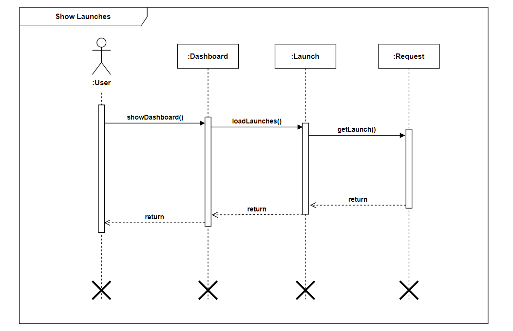

# Diagrama de Pacotes

Um diagrama de sequência é um tipo de diagrama de iteração focado na sequência em que as troca de mensagens entre várias linhas de vida ocorre. Por ser um tipo de diagrama de iteração, de maneira geral, o objetivo dele é expressar o comportamento entre os elementos utilizando a notação UML.

## Metodologia

Para o desenvolvimento dos esquemas, utilizamos as ferramentas do aplicativo [Draw.io](https://app.diagrams.net/) por já possuir os métodos e design padrão das representações de cada diagrama e seu facil acesso e compartilhamento via Google Drive.  
Foram feitos diagramas de sequência a iteração das funcionalidades principais do projeto. 

## Diagramas

### DS01
* **Mostrar Dados de Lançamento**

---

## Versionamento

|Data|Versão|Descrição|Autor|
|:--------:|:---:|:-------------------:|:------------:|
|07/03/2021| 0.1 | Criação do escopo do documento| Matheus Amaral
|07/03/2021| 0.2 | Adição de introdução e metodologia | Matheus Amaral
|08/03/2021| 0.3 | Adição dos diagramas DS01 e DS02 | Ailamar Alves e Matheus Amaral
  
 

### Referências

- Sequence Diagrams. Disponível em: https://www.uml-diagrams.org/sequence-diagrams.html. Último acesso em 08/03/2021.
- Aula - Modelagem UML Dinâmica. Milene Serrano. Disponível em: <https://aprender3.unb.br/pluginfile.php/639884/mod_label/intro/Arquitetura%20e%20Desenho%20de%20Software%20-%20Aula%20Modelagem%20UML%20Din%C3%A2mica%20-%20Profa.%20Milene.pdf> Acesso em: 08/03/2021.
