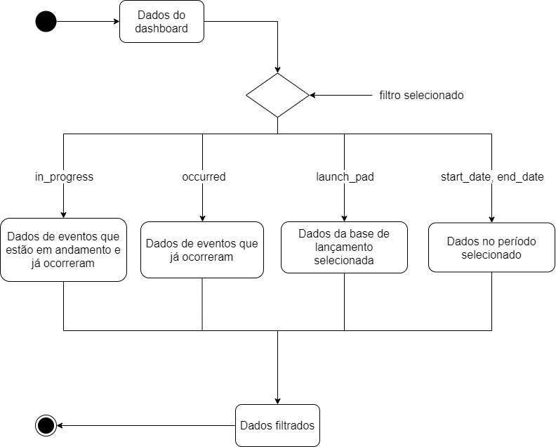
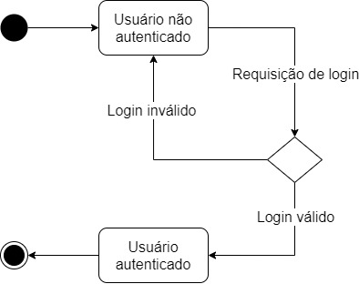

# Diagrama de Estados

O Diagrama de Estados tem como objetivo aprensentar as diferentes condições de um objeto, durante seu ciclo de vida, no decorrer da execução dos processos de um aplicação. Podendo ser possível visualizar os eventos que podem afetar a troca de estado do objeto.

## Metodologia

Para o desenvolvimento dos diagrams foi utilizado o [Draw.io](https://app.diagrams.net/). Artefatos usados como insumo para o desenvolvimento do documento: [Brainstorming](/pages/base/elicitation/brainstorming.md), [Introspecção](/pages/base/elicitation/introspeccao.md).

## Diagramas

### DE01 - Dashboard

### DE02 - Autenticação

---

## Versionamento

|Data|Versão|Descrição|Autor|
|:--------:|:---:|:-------------------:|:------------:|
|28/02/2021| 0.1 | Criação do escopo do documento| Heron Rodrigues 
|28/02/2021| 0.1 | Adição dos DE01 e DE02| Heron Rodrigues 
  
 

### Referências

- 06d - VídeoAula - DSW - Modelagem - Diagrama de Estados. Milene Serrano. Disponível em:  <https://unbbr-my.sharepoint.com/personal/mileneserrano_unb_br/_layouts/15/onedrive.aspx?id=%2Fpersonal%2Fmileneserrano%5Funb%5Fbr%2FDocuments%2FArqDSW%20%2D%20V%C3%ADdeosOriginais%2F06d%20%2D%20VideoAula%20%2D%20DSW%2DModelagem%20%2D%20Estados%2Emp4&parent=%2Fpersonal%2Fmileneserrano%5Funb%5Fbr%2FDocuments%2FArqDSW%20%2D%20V%C3%ADdeosOriginais&originalPath=aHR0cHM6Ly91bmJici1teS5zaGFyZXBvaW50LmNvbS86djovZy9wZXJzb25hbC9taWxlbmVzZXJyYW5vX3VuYl9ici9FVnQ1ang3YnZ0NUVpcWVsSnZjdE9XQUJnUE45OWJsbXpESWtRQ0ZHeFoyUmJ3P3J0aW1lPU0yV2hqZnZiMkVn>

- Smartdraw - State Diagram. Disponível em: <https://www.smartdraw.com/state-diagram/>. Acesso em fev. de 2021.

- Unified Modeling Language (UML) | State Diagrams. Disponível em: <https://www.geeksforgeeks.org/unified-modeling-language-uml-state-diagrams/>. Acesso em fev. de 2021.

- MICREIROS. Diagramas Comportamentais da UML: Diagrama de Estados. Disponível em: <https://micreiros.com/diagramas-comportamentais-da-uml-diagrama-de-estados/>. Acesso em: fev. de 2021.