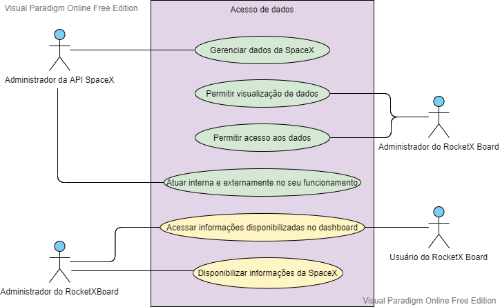

# Diagrama de Casos de Uso
 
## Histórico de Versão
 
<table>
  <thead>
    <tr>
      <th>Data</th>
      <th>Autor(es)</th>
      <th>Descrição</th>
      <th>Versão</th>  
    </tr>
  </thead>
 
  <tbody>
    <tr>
      <td>02/03/2021</td>
      <td>
        Ingrid Soares(<a target="blank" href="https://github.com/ingrdst">Ingrid</a>)
      </td>
      <td>Adicionando Introdução de diagramas de casos de uso</td>
      <td>0.1</td>
    </tr>
<tr>
      <td>02/03/2021</td>
      <td>
        Ingrid Soares(<a target="blank" href="https://github.com/ingrdst">Ingrid</a>)
      </td>
      <td>Adicionando diagramas</td>
      <td>0.2</td>
    </tr>

    
  </tbody>
</table>
 
## Introdução
 

&emsp;
O diagrama de Casos de Uso ademonstrar as diferentes maneiras que o usuário pode interagir com um sistema, por meio de cenários com funcionalidades descritas do sistema e suas interações com elementos externos e entre si. Por isso, é um método muito utilizado no levantamento de requisitos, além de facilitar a comunicação entre cliente e analista e ter o foco no cliente.
 

 
## Diagramas de Casos de Uso

### Autor: [Ingrid](https://github.com/ingrdst)
 

 
### Rastreabilidade
 

 
|ID|Descrição|
|--|--|

 
   
 
## Referências
<ul>
<li>
Diagrama de Casos de Uso. Disponível em: https://medium.com/operacionalti/uml-diagrama-de-casos-de-uso-29f4358ce4d5 
</li>
</ul>
