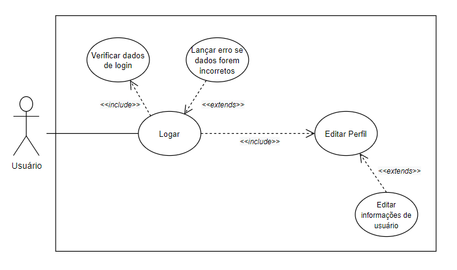
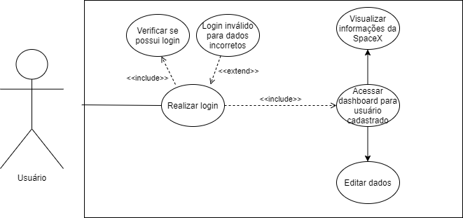

# Casos de Uso

Por meio do diagrama de casos de uso é possivel permitir a visualização do que o sistema faz do ponto de vista do usuário, de modo que a interação dessas funcionalidades com os usuários do mesmo sistema seja expressa de modo visual e descritivo. 

## Metodologia 

Para o desenvolvimento dos esquemas o grupo em geral utilizou ferramentas do [Draw.io](https://app.diagrams.net/) e do [Visual Paradigm](https://online.visual-paradigm.com/diagrams/solutions/free-visual-paradigm-online/) por já possuirem os métodos e design padrão das representações dos diagramas. 
Os diagramas abaixo foram feitos com base em funcionalidades levantadas pela equipe na parte de Elicitação de requisitos.

## Diagramas 

### UC01 - Diagrama Geral
 

|   |Descrição|
|:-:|:--------|
|Versão|0.1|
|Autor|Ingrid Soares|
|Descrição| Visualização geral das funções entre administrador da API, administrador do dashboard e usuário final|
|Atores| Administradores e usuários |
|Pré-condições| Interesse em comum em acessar dados da SpaceX |
|Fluxo Principal|- Administrador da API disponibiliza dados para administrador do dashboard que permite a visualização de conteúdo selecionado ao usuário final|
|Fluxo Alternativo| Não há fluxos alternativos|
|Fluxo de Exceções| Não há fluxos de exceções|
|Pós Condições| Informações ficam disponibilizadas aos usuários da RocketX Board |
 

### UC02 - Editar Perfil 
 

|   |Descrição|
|:-:|:--------|
|Versão|0.1|
|Autor|Ailamar Alves|
|Descrição| Poder editar suas informações de perfil|
|Atores| Usuários |
|Pré-condições| O usuário deve possuir uma conta no site |
|Fluxo Principal|- Acesso  após logar na conta  - Editar nome, foto de perfil, informações básicas ou email|
|Fluxo Alternativo| Não há fluxos alternativos|
|Fluxo de Exceções| Não há fluxos de exceções|
|Pós Condições| Suas informações editadas serão mantidas nos próximos acessos ao site |

  
### UC03 - Login
 

|   |Descrição|
|:-:|:--------|
|Versão|0.1|
|Autor|Ailamar Alves|
|Descrição| Poder realizar login|
|Atores| Usuários |
|Pré-condições| O usuário deve possuir cadastro |
|Fluxo Principal|- Com login efetuado, editar informações pessoais e visualizar informações sobre a SpaceX|
|Fluxo Alternativo| Não há fluxos alternativos|
|Fluxo de Exceções| Não há fluxos de exceções|
|Pós Condições| Ações realizadas, como edição de perfil ou adição de conteúdo à conta, como favoritar evento, ficam salvas na conta do usuário |

 
## Rastreabilidade

| ID | Rastro |
|:--:| :----- |
UC01 | -
UC02 | [Léxico LV-3 - Editar Perfil](https://unbarqdsw2020-2.github.io/2020.2_G6_RocketX/#/pages/modeling/lexico?id=tipo-verbo) |
UC03 | [Léxico LV-2 - Login](https://unbarqdsw2020-2.github.io/2020.2_G6_RocketX/#/pages/modeling/lexico?id=tipo-verbo) |
 

---

### Versionamento

| Data | Versão | Descrição | Autor |
|:----:|:-----: |:---------:|:-----:|
| 02/03/2021 | 0.1 | Adicionando introdução de diagrama de casos de uso  | Ingrid Soares
| 02/03/2021| 0.2 | Adicionando diagrama de casos de uso do cliente | Ingrid Soares 
| 04/03/2021| 0.3 | Adição diagrama UC02 | Ailamar Alves 
| 05/03/2021| 0.4 | Adição diagrama UC03 | Ingrid Soares
| 08/03/2021| 0.5 | Revisão do documento | Heron Rodrigues
 

### Referências

- Diagrama de Casos de Uso. Disponível em: <https://medium.com/operacionalti/uml-diagrama-de-casos-de-uso-29f4358ce4d5>. Acesso em: mar 2021. 

