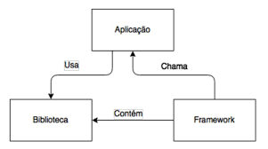

# Reutilização 

Como o próprio nome já diz, a reutilização se refere ao aproveitamento de algo já existente (soluções) para resolver problemas de mesma características.  
No contexto da Engenharia de Software, esse reúso refere-se a criação de software a partir de componentes, ideias ou processos já existentes.

É o processo de incorporar produtos existentes em um novo produto similar como código, testes, requisitos, etc.

**Pontos positivos**
- Maior produtividade;
- Menor tempo de desenvolvimento e validação
- Menor custo;
- Qualidade dos produtos;
- Manutenibilidade;
- Uso de padrões resultam em menos erros.

**Pontos negativos**
- Compreender artefatos de "outros";
- Qualidade dos artefatos;
- Modificar artefatos;
- Ferramentas de apoio para aprendizagem;
- Aspectos legais e econômicos;

## 1. Framework

“Um framework é uma coleção de classes abstratas e concretas, e uma interface entre elas, e um projeto para um subsistema” (WIRFS-BROCK E JOHNSON, 1990)

Frameworks impõem um modelos de colaboração.  
- Uma vez que a comunicação entre objetos está definida, o desenvolvedor não precisa saber quando chamar cada método. Isso é feito pelo Framework.
 
 - Estamos usando: 
    * ReactJS;
 
 - **Hotspots**: São partes do framework que são projetados para serem genéricos podendo ser adaptada para a necessidade do usuário. Normalmente são representadas por classes abstratas, ou seja, necessita de um baixo nível de acoplamento e por isso tem grande aproximação com os design patterns.
    * Temos: O arquivo base.js que faz uso design pattern Decorator, sendo ele uma classe genérica de controllers, ou seja, a partir dele podem ser especificados mais controllers.
 
 - **Frozenspots**: Também conhecido como "core" do framework, definem a arquitetura geral de um sistema de software e por isso permanecem fixos como a base do framework.
    * Temos: Os serviços de uso do back-end do diretório routes definidos pelas rotas já especializadas, onde tem uma entrada esperada e uma saída esperada.

## 2. Biblioteca

Bibliotecas de Classe são conjunto de funcionalidades genéricas que são agrupadas em arquivos (classes) que podem ser usadas em qualquer programa de qualquer forma.  
**Exemplo:** Biblioteca Math do Java - contém um monte de funcionalidades de cálculos - com acesso rapiso e prático.

Essas classem em termos gerais, podem ser disponibilizadas para reúso e importadas em diversas aplicações sendo compiladas juntamente com o restante do código.

**Biblioteca de Classes X Framework**

 

Em relação ao nosso projeto, todas as bibliotecas que utilizamos fazem parte do NodeJS e podem ser encontradas em node_modules, mesmo no caso de alguns frameworks do JavaScript, pois eles fazem uso de várias bibliotécas.

## 3. Serviços

* Serviços são ...

 - Nosso back-end por obedecer o padrão RESTful pode funciona como um provedor de serviço que é consumido no front-end ...

## 4. Componentes

* Componentes são...

(Procurar no Diagrama de Componentes) 

## 5. Outros

### 5.1 Plug-in

* Um plug-in tem como objetivo adicionar funcionalidades específicas para programas maiores que já tenham camadas de reutilização para poderem ser acoplados, adicionando um nível de reutilização e extensibilidade para tal framework ou qualquer outro programa maior.
 
### 5.2 Linha de Produto
 
* Uma linha ou família de produto faz uso de Engenharia de Domínio para se estabelecer e enriquecer um escopo sólido para o núcleo de artefatos, e planos de produção. Depois de estabelecer um escopo de um núcleo sólido, é feita a Engenharia de Aplicação, que vai aplicar especificações e derivações do núcleo definido em forma de produtos, retorno, novos artefatos e demais aplicações. Porém, o grande problema da linha de produto é a complexidade muito alta, a dificuldade de se estabelecer ideias totalmente coesas entre si e os gastos.

---

## Versionamento

|Data|Versão|Descrição|Autor|
|:--:|:----:|:-------:|:---:|
|03/05/2021| 0.1 | Criação do escopo do documento| Matheus Amaral 
|03/05/2021| 0.2 | Introdução e definição de Bibliotecas| Ailamar Alves
 

### Referências

- Aula - Reutilização e Framework. Milene Serrano.Disponível em: <https://aprender3.unb.br/pluginfile.php/639905/mod_label/intro/Arquitetura%20e%20Desenho%20de%20Software%20-%20Aula%20Reutiliza%C3%A7%C3%A3o%20%20Framework%20-%20Profa.%20Milene.pdf> Acesso em: abril, 2021.

- Reúso de Software. Thainá Mariani, 2016. Disponível em: <https://www.inf.ufpr.br/silvia/ES/reuso/reusoAl.pdf> Acesso em: maio, 2021.